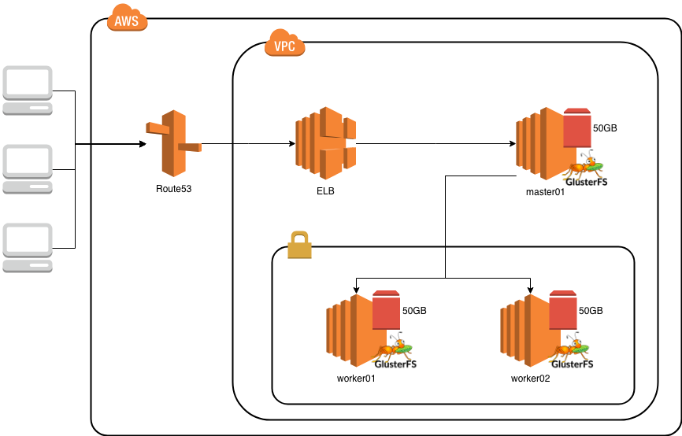

# Openshift deployment on AWS



## prerequisites
* ansible 2.5.5
* `git clone --recursive <this_repo>`
* `ssh-keygen -N "" -t rsa -b 4096 -C "your_email@example.com" -f ./ssh-keys/andrejmaya-eu-central-1`
* `aws ec2 import-key-pair --key-name andrejmaya-eu-central-1 --public-key-material file://./ssh-keys/andrejmaya-eu-central-1.pub`
* go to https://aws.amazon.com/marketplace/pp?sku=aw0evgkw8e5c1q413zgy5pjce and accept
* create stack:
```
aws cloudformation create-stack \
 --region eu-central-1 \
 --stack-name sysdig-origin-1 \
 --template-url "https://s3.eu-central-1.amazonaws.com/sysdig-cloudformation/cloudformation_1mas_2wrk.yaml" \
 --parameters \
   ParameterKey=AvailabilityZone,ParameterValue=eu-central-1a \
   ParameterKey=KeyName,ParameterValue=andrejmaya-eu-central-1 \
 --capabilities=CAPABILITY_IAM
```
* go the AWS console and put the *Private DNS* names into the `hosts.aws`
* put the *IPv4 Public IP* and the *Private DNS* mapping to your `/etc/hosts` file like this
```
18.196.46.156 ip-10-0-0-4.eu-central-1.compute.internal
18.196.46.152 ip-10-0-0-2.eu-central-1.compute.internal
18.196.46.153 ip-10-0-0-3.eu-central-1.compute.internal
```

`
## run playbooks
* `ansible-playbook prepare.yml -i hosts.aws --key-file ./ssh-keys/andrejmaya-eu-central-1`
* `ansible-playbook -i hosts.aws openshift-ansible/playbooks/prerequisites.yml --key-file ./ssh-keys/andrejmaya-eu-central-1`
* `ansible-playbook -i hosts.aws openshift-ansible/playbooks/deploy_cluster.yml --key-file ./ssh-keys/andrejmaya-eu-central-1`


## create user

`htpasswd /etc/openshift/openshift-passwd developer`

Password: `developer`

## uninstall

1. `ansible-playbook -i hosts.aws ./openshift-ansible/playbooks/openshift-glusterfs/uninstall.yml --key-file ./ssh-keys/andrejmaya-eu-central-1`
1. `ansible-playbook -i hosts.aws ./openshift-ansible/playbooks/adhoc/uninstall.yml --key-file ./ssh-keys/andrejmaya-eu-central-1`
1. execute this on the glusterfs nodes:
    1. `sudo su`
    1. `vgs`
    1. `vgremove -f <name_of_the_vg>`
    1. `pvremove -v -f /dev/xvdb`

## delete stack
`aws cloudformation delete-stack --stack-name=sysdig-origin-1`

## update cloudformation template
* `aws s3 cp ./s3/ s3://sysdig-cloudformation/  --recursive`


## ssh access
`ssh -i ./ssh-keys/ansible-eu-central-1 centos@<AWS_HOST_IP>`

## own domain
If you want to use your own Route53 domain, add `Domainname` parameter to cloudformation command.

## troubleshooting
if gets stucked at "template_service_broker : Verify that TSB is running"
* oc get events -n openshift-template-service-broker